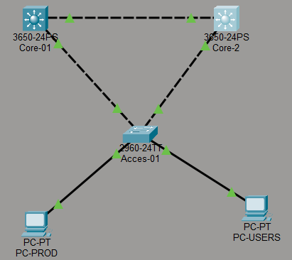

# Infrastructure Réseau Critique : Hub de Distribution Haute Disponibilité

**Développé par : Elif JAFFRES**

---

## Présentation du Projet

Ce projet expose la conception et l'implémentation d'une infrastructure réseau robuste et hautement disponible, simulée via l'environnement Cisco Packet Tracer.


## Objectifs Techniques & Stratégiques

- **Segmentation Logique** : Isolation des flux critiques (PROD) et des flux utilisateurs (USERS) pour renforcer la sécurité et optimiser la bande passante.
- **Routage Inter-VLAN Haute Performance** : Utilisation de commutateurs de Niveau 3 pour décharger les fonctions de routage (Offloading) et réduire la latence.
- **Continuité de Service (High Availability)** : Déploiement du protocole HSRP pour une tolérance aux pannes matérielles transparente.
- **Stabilité Structurelle** : Optimisation du Spanning Tree Protocol (STP) pour prévenir les boucles de commutation et garantir une topologie déterministe.

---

## Architecture & Spécifications

### 1. Topologie Matérielle
- **Cœur/Distribution** : 2x Cisco Multilayer Switch 3650 (Multi-couches).
- **Accès** : 1x Cisco Switch 2960.
- **Terminaux** : Stations de travail segmentées par département.

### 2. Matrice d'Adressage & VLANs

| Segment | VLAN | Réseau IP | Passerelle Virtuelle (VIP HSRP) | Priorité (Master) |
| :--- | :---: | :--- | :--- | :--- |
| **Production** | 10 | 192.168.10.0/24 | 192.168.10.254 | Core-01 |
| **Utilisateurs** | 20 | 192.168.20.0/24 | 192.168.20.254 | Core-01 |

---

## 🛠 Guide d'Implémentation Détaillé

### Section I : Infrastructure de Niveau 2 (L2)

L'établissement d'une base L2 solide est impérative pour le transport multi-VLAN.

#### A. Segmentation par VLAN
```bash
vlan 10
 name PROD
vlan 20
 name USERS
```
*   **vlan [ID]** : Initialise l'identifiant logique du réseau au sein de la base de données du commutateur.
*   **name [LABEL]** : Définit une étiquette sémantique pour l'administration et le monitoring.

#### B. Agrégation de Liens (802.1Q Trunking)
Le Trunking permet le multiplexage de plusieurs VLANs sur une interface physique unique.

```bash
# Configuration des switchs coeurs (Core-01 / Core-02)
interface range gig1/0/1-2
 switchport trunk encapsulation dot1q
 switchport mode trunk
```
*   **interface range** : Configuration groupée des interfaces gigabit pour une cohérence de paramétrage.
*   **switchport trunk encapsulation dot1q** : Définit le protocole d'étiquetage (Tagging) standard IEEE 802.1Q.
*   **switchport mode trunk** : Force l'interface en mode agrégé, autorisant le passage des trames marquées.

---

### Section II : Routage & Passerelles Virtuelles (SVI)

La transition vers la couche 3 permet l'interopérabilité entre les segments isolés.

#### A. Activation du Moteur de Routage IP
```bash
ip routing
```
*   **ip routing** : Commande critique activant les fonctions de commutation L3 et la gestion de la table de routage IP sur le matériel multicouches.

#### B. Configuration des Switch Virtual Interfaces (SVI)
```bash
interface vlan 10
 ip address 192.168.10.1 255.255.255.0
 no shutdown
```
*   **interface vlan [ID]** : Crée une interface logique de niveau 3 liée au VLAN correspondant.
*   **ip address [IP] [MASK]** : Assigne l'adresse physique du nœud au sein du segment.
*   **no shutdown** : Active administrativement l'interface.

---

### Section III : Haute Disponibilité & Haute Disponibilité (HSRP)

Pour garantir un temps de rétablissement (RTO) minimal, le protocole **Hot Standby Router Protocol (HSRP)** est déployé.

```bash
# Configuration sur le nœud primaire (Core-01)
interface vlan 10
 standby 10 ip 192.168.10.254
 standby 10 priority 110
 standby 10 preempt
```
- **standby 10 ip [VIP]** : Définit l'adresse IP virtuelle (Passerelle par défaut des clients).
- **standby 10 priority 110** : Assure que Core-01 sera le nœud **Active** (Priorité par défaut : 100).
- **standby 10 preempt** : Permet au nœud primaire de récupérer son rôle actif dès son rétablissement après une défaillance.

---

### Section IV : Optimisation STP (Anti-Boucle)

L'alignement du Root Bridge STP avec le Master HSRP est une "Best Practice" pour optimiser les flux de données.

```bash
spanning-tree vlan 10,20 priority 4096
```
- **spanning-tree vlan [IDs] priority 4096** : Force le commutateur à devenir le pont racine (**Root Bridge**), structurant la topologie logique pour éviter les chemins sous-optimaux ou les tempêtes de broadcast.

---

## Validation du Plan de Continuité d'Activité

### 1. Protocole de Certification
- **Test ICMP (Ping)** : Validation des routes statiques et SVIs entre les segments 10 et 20.
- **Audit des états HSRP** : Exécution de `show standby brief` pour confirmer la synchronisation des nœuds.

### 2. Simulation de Désastre (Failover Test)
En simulant une rupture totale du nœud **Core-01**, le nœud **Core-02** détecte l'absence de messages "Hello" HSRP et procède à l'appropriation de l'adresse IP virtuelle en moins d'une seconde. Cette résilience garantit une disponibilité de service conforme aux exigences critiques des secteurs industriels de pointe.
